# PharmacyFinder

**The Deal Machine** — finds specific premises in Australia where a new pharmacy can be approved under the [Pharmacy Location Rules](https://www.health.gov.au/topics/pharmacist-services/pharmacy-location-rules), evaluates them against every ACPA rule item, scores commercial viability, and generates application-ready evidence packages.

V1/V2 found *zones*. V3 finds **specific addresses with specific public access doors**, measured to the millimetre.

## Who Is This For?

- **Pharmacy investors** seeking greenfield sites with quantified ROI
- **Existing operators** evaluating expansion or relocation
- **Consultants** building ACPA applications with evidence packages
- **Pharmacy groups** monitoring competitors and market gaps

## Architecture

```mermaid
flowchart LR
    subgraph Sources["Data Sources"]
        PBS["PBS Approved\nSuppliers"]
        OSM["OpenStreetMap"]
        AIHW["AIHW Hospitals"]
        ABS["ABS Boundaries\n& Population"]
        CRE["Commercial RE\nListings"]
        DA["Council DAs"]
    end

    subgraph Engine["Rules Engine"]
        direction TB
        GEN["General\nRequirements"]
        R130["Item 130\n≥1.5km + supermarket/GP"]
        R131["Item 131\n≥10km by road"]
        R132["Item 132\nSame-town additional"]
        R133["Item 133\nSmall shopping centre"]
        R134["Item 134/134A\nLarge shopping centre"]
        R135["Item 135\nPrivate hospital ≥150 beds"]
        R136["Item 136\nMedical centre ≥8 FTE"]
    end

    subgraph Scoring["Scoring & Analysis"]
        COM["Commercial Score\n(7 weighted factors)"]
        MIN["Ministerial\nDiscretion"]
        RISK["Risk Assessment\n(all relevant times)"]
        PROF["Profitability\nEstimator"]
    end

    subgraph Output["Output"]
        DASH["FastAPI\nDashboard"]
        EVID["Evidence\nPackages"]
        WATCH["Watchlist\nAlerts"]
        RPT["Reports\n& CSVs"]
    end

    Sources --> Engine
    Engine --> Scoring
    Scoring --> Output
```



### Key Modules

| Module | Purpose |
| ------ | ------- |
| `engine/` | Three-pass rules engine — exclusion gates, rule evaluation (Items 130–136), commercial scoring |
| `engine/rules/` | One file per ACPA rule item with standalone `check_item_XXX()` functions |
| `engine/context.py` | Spatial query engine with grid-based indexes over all reference data |
| `analysis/` | Profitability estimator — scripts, revenue, GP, setup costs, ROI, payback |
| `api/` | FastAPI web app with interactive Leaflet dashboard |
| `evidence/` | PDF evidence package generator for ACPA applications |
| `watchlist/` | Hawk mode — monitors near-miss sites, pharmacy closures, GP movements |
| `data/sources/` | PBS Suppliers, ABS boundaries/population importers |
| `candidates/` | Commercial RE and council DA candidate pipeline |
| `scripts/` | CLI utilities for scanning, reporting, verification, monitoring |
| `utils/` | Database schema, geodesic/OSRM distance, geocoding, boundary helpers |

### Database Schema

SQLite (`pharmacy_finder.db`) with these core tables:

| Table | Purpose | Key Columns |
| ----- | ------- | ----------- |
| `pharmacies` | All approved pharmacy locations | name, address, lat/lon, state, postcode |
| `gps` | GP practices | name, address, lat/lon, fte, hours_per_week |
| `supermarkets` | Supermarket locations | name, address, lat/lon, estimated_gla, brand |
| `hospitals` | Hospital locations | name, address, lat/lon, bed_count, hospital_type |
| `shopping_centres` | Shopping centre data | name, address, lat/lon, estimated_gla, estimated_tenants, centre_class |
| `medical_centres` | Medical centre data | name, address, lat/lon, num_gps, total_fte, hours_per_week |
| `v2_results` | Rules engine evaluation output | id, passed_any, primary_rule, commercial_score, rules_json |
| `opportunities` | Proactive scanner results | lat/lon, qualifying_rules, confidence, pop_5km |
| `properties` | Commercial RE listings | address, lat/lon, size_sqm, agent details |
| `watchlist_items` | Hawk mode monitoring | candidate_id, watch_reason, trigger_condition, status |
| `watchlist_alerts` | Change detection events | alert_type, message, severity, triggered_date |
| `council_das` | Council development applications | da_number, address, pharmacy_potential |
| `population_grid` | ABS SA2 population data | lat, lon, population |
| `geocode_cache` | Nominatim response cache | address, lat/lon |

---

## Quick Start

### Prerequisites

- **Python 3.12**
- **Docker** (optional — for self-hosted OSRM routing)
- No paid API keys required (all free data sources)

### Install

```bash
git clone <repo-url> && cd PharmacyFinder
pip install -r requirements.txt
```

Dependencies: `geopy`, `requests`, `beautifulsoup4`, `pandas`, `folium`, `selenium`, `lxml`, `APScheduler`, `python-dotenv`, `webdriver-manager`

### Database Setup

The database is created automatically on first run. To start fresh:

```bash
# Scan Tasmania (smallest state — fast first run)
py -3.12 main.py scan --region TAS
```

This will: collect pharmacies, GPs, supermarkets, hospitals, and shopping centres from OpenStreetMap → run the rules engine against every POI → output results to `output/`.

### Optional: Self-Hosted OSRM

For accurate road distances (Item 131/132) without rate limits:

```bash
# Download Australia OSM data and start routing engine
docker compose up -d osrm

# Also available: local Nominatim geocoder and PostGIS
docker compose up -d
```

### Run the Dashboard

```bash
pip install fastapi uvicorn
py -3.12 -m uvicorn api.app:app --reload --port 8000
```

Open `http://localhost:8000` for the interactive map dashboard.

---

## Available Commands

### Main CLI

```bash
py -3.12 main.py <command> [options]
```

| Command | Description |
| ------- | ----------- |
| `scan` | Collect reference data + run rules engine (recommended) |
| `collect` | Collect reference data only (no evaluation) |
| `check` | Legacy: scrape commercial properties and check eligibility |
| `stats` | Show database record counts |

**Scan options:**

```bash
py -3.12 main.py scan --region TAS                    # Scan one state
py -3.12 main.py scan --region TAS --skip-collect      # Re-evaluate with existing data
py -3.12 main.py scan --region TAS --with-properties   # Also scrape commercial RE
py -3.12 main.py scan --region NSW --output-dir results/
```

**Regions:** `NSW`, `VIC`, `QLD`, `WA`, `SA`, `TAS`, `NT`, `ACT`

### Rules Engine Pipeline (Direct)

```bash
py -3.12 -m engine.pipeline --state TAS    # Single state
py -3.12 -m engine.pipeline --all          # All 8 states/territories
```

### Scripts

#### Profitability Analysis

```bash
# Estimate revenue, GP, setup costs, payback for qualifying sites
py -3.12 scripts/run_profitability.py --top 20
py -3.12 scripts/run_profitability.py --top 50 --db pharmacy_finder.db
```

Output: `output/profitability_analysis.csv`

#### Reporting

```bash
# Daily opportunity summary
py -3.12 scripts/notify_opportunities.py
py -3.12 scripts/notify_opportunities.py --since 2025-01-15

# Weekly executive report
py -3.12 scripts/weekly_report.py
py -3.12 scripts/weekly_report.py --week 2025-01-13
```

Output: `output/daily_summary.md`, `output/weekly_report.md`

#### Council DA Scanning

```bash
# Scan council DAs for pharmacy-relevant developments
py -3.12 scripts/scan_council_das.py --state TAS
py -3.12 scripts/scan_council_das.py --state NSW --evaluate

# Targeted DA scan around qualifying sites
py -3.12 scripts/scan_das_targeted.py
py -3.12 scripts/scan_das_targeted.py --radius 3000 --state TAS
py -3.12 scripts/scan_das_targeted.py --dry-run
```

Requires: `PLANNING_ALERTS_KEY` env var (free at planningalerts.org.au)

#### Monitoring & Verification

```bash
# ACPA competitor application monitor
py -3.12 scripts/acpa_monitor.py

# Ministerial discretion scan (borderline near-miss sites)
py -3.12 scripts/scan_ministerial.py

# Relocation opportunity scan (Items 121-125)
py -3.12 scripts/scan_relocations.py

# Data integrity check (coordinates, duplicates, anomalies)
py -3.12 scripts/data_integrity_check.py

# Deduplicate pharmacy records
py -3.12 scripts/deduplicate_pharmacies.py             # Dry run
py -3.12 scripts/deduplicate_pharmacies.py --apply      # Apply merges

# Commercial property cross-reference
py -3.12 scripts/run_property_scan.py --state TAS --limit 50

# Database inspection
py -3.12 scripts/inspect_db.py
```

---

## Data Sources

| Data | Source | Update Method |
| ---- | ------ | ------------- |
| Pharmacies | PBS Approved Suppliers (findapharmacy.com.au) + OpenStreetMap | `main.py collect` or `data/sources/pbs_suppliers.py` |
| GPs / Clinics | OpenStreetMap + Healthdirect | `main.py collect` |
| Supermarkets | OpenStreetMap (Overpass API) | `main.py collect` |
| Hospitals | AIHW curated list + OpenStreetMap | `main.py collect` |
| Shopping Centres | Curated list (GLA + tenant data) + OpenStreetMap | `main.py collect` |
| Medical Centres | Healthdirect + Hotdoc aggregation | `main.py collect` |
| Town Boundaries | ABS ASGS 2021 SAL + POA (ArcGIS FeatureServer) | `data/sources/abs_boundaries.py` |
| Population | ABS 2021 ERP by SA2 | `data/sources/abs_population.py` |
| Road Distances | OSRM (public or self-hosted Docker) | On-demand (cached) |
| Geocoding | Nominatim (public or self-hosted Docker) | On-demand (cached 30 days) |
| Commercial Properties | realcommercial.com.au, commercialrealestate.com.au | `scripts/run_property_scan.py` |
| Council DAs | PlanningAlerts.org.au API | `scripts/scan_council_das.py` |

---

## Rules Engine

### Three-Pass Evaluation

1. **Pass 1 — General Requirements:** Boolean gates that must ALL pass (zoning, public access, not already approved, not inside supermarket, 6-month readiness)
2. **Pass 2 — Rule Items 130–136:** Each candidate is evaluated against all applicable rules
3. **Pass 3 — Scoring:** Commercial score, ministerial discretion assessment, risk analysis

### ACPA Rule Items

| Item | Name | Key Requirement | Distance | Measurement |
| ---- | ---- | --------------- | -------- | ----------- |
| **130** | New pharmacy (urban) | ≥1.5 km from nearest + supermarket/GP within 500m | 1.5 km | Geodesic |
| **131** | New pharmacy (rural) | ≥10 km by road from nearest pharmacy | 10 km | OSRM route |
| **132** | Same-town additional | ≥200m from nearest, ≥10km route from others, ≥4 FTE GPs, ≥2500sqm supermarket GLA | 200m / 10 km | Geodesic + OSRM |
| **133** | Small shopping centre | Centre ≥5000sqm GLA, ≥15 tenants, supermarket ≥2500sqm, ≥500m from pharmacy | 500m | Geodesic |
| **134** | Large shopping centre | Centre ≥5000sqm GLA, ≥50 tenants, no existing pharmacy in centre | None | N/A |
| **134A** | Large centre (additional) | 100-199 tenants → max 1 existing; ≥200 tenants → max 2 existing | None | N/A |
| **135** | Private hospital | Private hospital ≥150 beds, no pharmacy in hospital | Within 300m | Geodesic |
| **136** | Large medical centre | ≥8 FTE PBS prescribers (≥7 medical), ≥70 hrs/week, ≥300m from pharmacy | 300m | Geodesic |

### Confidence Scoring

Based on measurement margin above the rule threshold:

| Margin | Confidence | Interpretation |
| ------ | ---------- | -------------- |
| > 500m | 0.95 | High — safe margin |
| 200–500m | 0.85 | Good — comfortable |
| 50–200m | 0.75 | Moderate — needs precise measurement |
| < 50m | 0.65 | Low — surveyor-grade evidence required |

### Commercial Scoring

Weighted composite score (0.0–1.0) for ranking qualifying sites:

| Factor | Weight | Source |
| ------ | ------ | ------ |
| Legal robustness | 35% | Best confidence score among passing rules |
| Demand potential | 20% | Population within 10 km (normalized to 200k) |
| GP adjacency | 15% | GP count within 5 km (normalized to 20) |
| Anchor traffic | 10% | Supermarkets within 1 km (normalized to 3) |
| Lease economics | 10% | Placeholder (0.5) |
| Parking access | 5% | Placeholder (0.5) |
| Area growth | 5% | Growth indicator (high=0.9, medium=0.6, low=0.4) |

### Ministerial Discretion (Section 90A(2))

Sites that *fail* a rule but are within 15% of the threshold are flagged as ministerial candidates with a community need score based on population-to-pharmacy ratio.

---

## Output

### Evidence Packages

Generated for shortlisted sites to support ACPA applications:

- **Distance measurements** — geodesic and road distances with audit trail
- **Pharmacy proximity map** — all approved pharmacies within relevant radius
- **GP/prescriber documentation** — practice names, headcounts, FTE estimates
- **Shopping centre evidence** — tenancy schedule, GLA, management structure
- **Risk assessment** — "all relevant times" analysis (what could change before hearing)
- **General requirements checklist** — all boolean gates with status
- **Ministerial case** (if borderline) — community need, population data, access gaps

### Dashboard

```bash
py -3.12 -m uvicorn api.app:app --reload
```

Interactive Leaflet map at `http://localhost:8000` with:

- National overview of qualifying sites
- Filter by state, rule item, minimum score
- Click-through to full evaluation detail
- Heatmap of opportunity density
- Pharmacy desert analysis
- Competitive landscape by state
- Watchlist management and alerts

### Reports

| Report | Command | Output |
| ------ | ------- | ------ |
| Daily summary | `py -3.12 scripts/notify_opportunities.py` | `output/daily_summary.md` |
| Weekly executive | `py -3.12 scripts/weekly_report.py` | `output/weekly_report.md` |
| Profitability ranking | `py -3.12 scripts/run_profitability.py --top 20` | `output/profitability_analysis.csv` |
| Data integrity | `py -3.12 scripts/data_integrity_check.py` | `output/integrity_report.json` |
| Ministerial candidates | `py -3.12 scripts/scan_ministerial.py` | `output/ministerial_candidates.json` |
| Competitor applications | `py -3.12 scripts/acpa_monitor.py` | `output/competitor_applications.json` |

### Profitability Metrics

For each qualifying site:

| Metric | Formula |
| ------ | ------- |
| Annual scripts | `(pop_5km / (pharmacies_5km + 1)) × 16.0 × GP_boost` |
| Annual revenue | `(scripts × $8.50) / 0.65` |
| Gross profit | `revenue × 0.33` |
| Setup cost | `fitout ($250k–$400k) + stock ($200k) + working capital ($75k)` |
| Payback | `setup_cost / annual_GP` |
| 12-month exit value | `annual_revenue × 0.4` |
| Flip profit | `exit_value − setup_cost` |
| Score (0–100) | Weighted: revenue (30) + GP (25) + payback (25) + flip (25) |

---

## API Reference

Base URL: `http://localhost:8000`

### Sites

| Endpoint | Description |
| -------- | ----------- |
| `GET /api/sites/stats` | Total qualifying sites, breakdown by state and rule, average commercial score |
| `GET /api/sites?state=NSW&rule=Item+130&min_score=0.5&limit=50&offset=0` | Paginated list of qualifying sites with optional filters |
| `GET /api/sites/{site_id}` | Full detail for a single site including all rule evaluations |

### Evaluate

| Endpoint | Description |
| -------- | ----------- |
| `POST /api/evaluate` | On-demand evaluation of any address or coordinate against all rules |
| `GET /api/evaluate/{site_id}` | Retrieve stored evaluation for an existing v2_results entry |

POST body accepts either `{"address": "123 Main St, Hobart TAS 7000"}` or `{"lat": -42.8821, "lon": 147.3272}`. Returns pass/fail for each item, confidence, distances, evidence needed.

### Analytics

| Endpoint | Description |
| -------- | ----------- |
| `GET /api/analytics/overview` | National summary: total qualifying, by rule, by state, top 10 sites, data freshness |
| `GET /api/analytics/heatmap` | GeoJSON FeatureCollection of opportunity density for map visualization |
| `GET /api/analytics/gaps?min_gap_km=10&min_population=2000` | Pharmacy desert analysis: areas > N km from nearest pharmacy with significant population |
| `GET /api/analytics/competition` | Competitive landscape: pharmacy density per 10k population by state |

### Watchlist

| Endpoint | Description |
| -------- | ----------- |
| `GET /api/watchlist` | All monitored sites with enriched site data |
| `POST /api/watchlist` | Add a site to watchlist (body: candidate_id, watch_reason, trigger_condition, check_frequency) |
| `DELETE /api/watchlist/{item_id}` | Remove item from watchlist |
| `GET /api/watchlist/alerts` | Pending (unacknowledged) change-detection alerts |

---

## Project Structure

```
PharmacyFinder/
├── main.py                              # CLI entry point (scan, collect, check, stats)
├── config.py                            # All thresholds, API keys, scoring weights
├── SPEC_V3.md                           # V3 architecture specification
├── requirements.txt                     # Python dependencies
├── docker-compose.yml                   # OSRM + Nominatim + PostGIS
├── pharmacy_finder.db                   # SQLite database (gitignored)
│
├── engine/                              # Rules engine (3-pass evaluation)
│   ├── models.py                        #   Candidate, RuleResult, EvaluationResult
│   ├── context.py                       #   Spatial index + geodesic queries
│   ├── evaluator.py                     #   Three-pass orchestrator
│   ├── pipeline.py                      #   Candidate generation + batch evaluation
│   ├── scoring.py                       #   Commercial ranking (7 weighted factors)
│   ├── general_requirements.py          #   V3 general requirements checker
│   ├── ministerial.py                   #   Section 90A(2) discretion scoring
│   ├── risk_assessment.py               #   "All relevant times" risk analysis
│   └── rules/
│       ├── general.py                   #     Confidence scoring + boolean gates
│       ├── item_130.py                  #     New pharmacy ≥1.5km
│       ├── item_131.py                  #     New pharmacy ≥10km by road
│       ├── item_132.py                  #     Same-town additional
│       ├── item_133.py                  #     Small shopping centre
│       ├── item_134.py                  #     Large shopping centre (no pharmacy)
│       ├── item_134a.py                 #     Large shopping centre (additional)
│       ├── item_135.py                  #     Private hospital ≥150 beds
│       ├── item_136.py                  #     Medical centre ≥8 FTE
│       └── relocations.py              #     Items 121–125 relocation rules
│
├── analysis/
│   └── profitability.py                 # Revenue, GP, ROI, payback estimator
│
├── api/                                 # FastAPI web application
│   ├── app.py                           #   App setup, CORS, static files
│   ├── routes/
│   │   ├── analytics.py                 #     /api/analytics/* endpoints
│   │   ├── evaluate.py                  #     /api/evaluate endpoints
│   │   ├── sites.py                     #     /api/sites/* endpoints
│   │   └── watchlist.py                 #     /api/watchlist/* endpoints
│   └── static/                          #   Dashboard frontend (HTML/JS/CSS)
│
├── evidence/                            # Evidence package generator
│   ├── checklist.py                     #   Master evidence checklist
│   ├── distance_maps.py                 #   Distance measurement maps
│   ├── pdf_generator.py                 #   Full application package PDF
│   ├── risk_report.py                   #   Risk assessment document
│   └── report_runner.py                 #   Orchestrator
│
├── watchlist/                           # Hawk mode monitoring
│   ├── models.py                        #   WatchlistItem, WatchlistAlert
│   ├── manager.py                       #   CRUD + auto-populate near-misses
│   ├── monitor.py                       #   Change detection engine
│   ├── alerts.py                        #   Notification system
│   └── db.py                            #   Watchlist table setup
│
├── data/
│   ├── sources/
│   │   ├── pbs_suppliers.py             #   PBS Approved Suppliers (primary pharmacy list)
│   │   ├── abs_boundaries.py            #   ABS SAL/POA boundaries
│   │   └── abs_population.py            #   ABS SA2 population grid
│   └── enrichment/                      #   GP FTE, SC tenant, hospital bed verifiers
│
├── candidates/                          # Candidate premises pipeline
│   ├── commercial_re.py                 #   Commercial RE listing scraper
│   ├── council_da.py                    #   Council DA monitor
│   └── candidate_manager.py             #   CRUD + dedup + geocoding
│
├── scripts/                             # CLI utilities
│   ├── run_profitability.py             #   Profitability analysis
│   ├── notify_opportunities.py          #   Daily summary report
│   ├── weekly_report.py                 #   Weekly executive report
│   ├── scan_council_das.py              #   Council DA scanner
│   ├── scan_das_targeted.py             #   Targeted DA scan around sites
│   ├── scan_ministerial.py              #   Ministerial discretion scanner
│   ├── scan_relocations.py              #   Relocation opportunity scanner
│   ├── acpa_monitor.py                  #   Competitor application monitor
│   ├── data_integrity_check.py          #   Database validation
│   ├── deduplicate_pharmacies.py        #   Pharmacy deduplication
│   ├── run_property_scan.py             #   Commercial property cross-reference
│   └── inspect_db.py                    #   Quick DB inspection
│
├── utils/
│   ├── database.py                      #   SQLite schema + queries
│   ├── distance.py                      #   Geodesic + OSRM routing
│   ├── geocoding.py                     #   Nominatim geocoder
│   ├── boundaries.py                    #   State/territory bounding boxes
│   └── overpass_cache.py                #   OSM Overpass API caching (7-day TTL)
│
├── scrapers/                            # Data collection scrapers
├── scanner/                             # Legacy V1 zone scanner
├── rules/                               # Reference documents (handbook text)
├── tests/                               # Pytest test suite
│   ├── conftest.py                      #   Fixtures (test DB, context, candidates)
│   ├── test_rules_engine.py             #   60 tests across Items 130–136
│   └── test_profitability.py            #   31 tests for financial formulas
├── cache/                               # Cached API responses (gitignored)
└── output/                              # Generated reports, maps, CSVs
```

---

## Tests

```bash
py -3.12 -m pytest tests/ -v
```

**91 tests** validating the rules engine (Items 130–136, general requirements, confidence scoring, boundary conditions) and profitability estimator (revenue, GP, payback, setup costs, ROI, score components).

---

## License

Private — not for redistribution.
